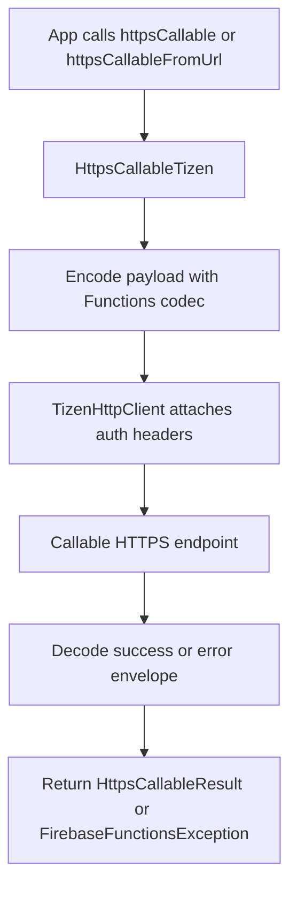
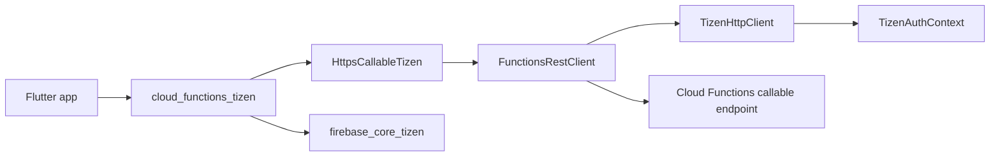

# cloud_functions_tizen

[](https://pub.dev/packages/cloud_functions_tizen)

The Tizen implementation of
[`cloud_functions`](https://pub.dev/packages/cloud_functions).

Non-endorsed federated plugin — add it alongside `cloud_functions` and
`firebase_core_tizen`. For authenticated calls, also add
`firebase_auth_tizen`: the Tizen Auth Context brokers the ID token used on
every callable request.

## Required privileges

```xml
<privileges>
  <privilege>http://tizen.org/privilege/internet</privilege>
</privileges>
```

## Usage

```yaml
dependencies:
  cloud_functions: ^6.2.0
  cloud_functions_tizen: ^0.2.0
  firebase_core: ^4.7.0
  firebase_core_tizen: ^2.0.0
```

```dart
// Gen1 callable (default name-based endpoint).
final HttpsCallable fn = FirebaseFunctions.instance.httpsCallable('addTwo');
final HttpsCallableResult<dynamic> result = await fn(<String, int>{
  'a': 1,
  'b': 2,
});
print(result.data);

// Gen2 callable (direct URL).
final HttpsCallable gen2 = FirebaseFunctions.instance.httpsCallableFromUrl(
  'https://addtwo-abc123-uc.a.run.app',
);
```

## Supported devices

| Tizen version | TV | TV emulator |
|:-------------:|:--:|:-----------:|
| 6.0 and above | ✔️  | ✔️           |

## Limitations

* **Streaming callables** (`HttpsCallable.stream`) throw `UnimplementedError`.
  The wire format is still evolving and we will add support once stable.
* **Emulator origin override** throws `UnimplementedError` — the emulator
  relies on loopback TLS that Tizen TV devices do not trust.
* **App Check tokens** are not attached — Tizen has no Play Integrity /
  DeviceCheck / reCAPTCHA provider; enable App Check custom-provider
  enforcement in your Functions only if your backend accepts
  server-minted custom tokens.

## Package structure

* `lib/cloud_functions_tizen.dart`: public registration entrypoint.
* `lib/src/firebase_functions_tizen.dart`: `FirebaseFunctionsPlatform` implementation and region/app scoping.
* `lib/src/https_callable_tizen.dart`: callable wrapper and payload encoding.
* `lib/src/functions_rest_client.dart`: direct HTTPS transport for gen1/gen2 callable endpoints.
* `lib/src/codec.dart`: upstream-compatible argument/result normalization.

## Flow chart



## Architecture chart


