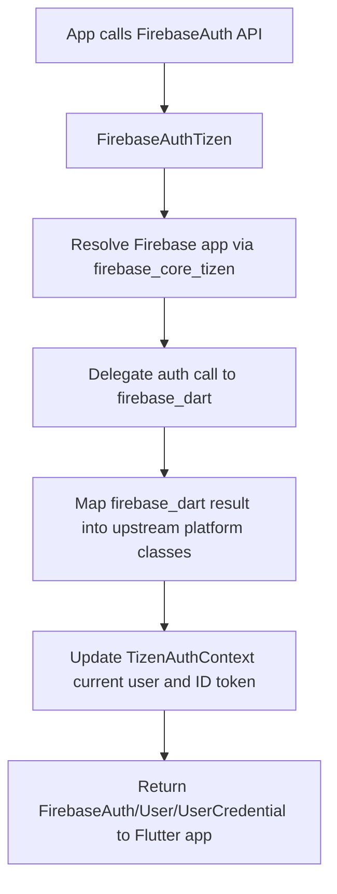
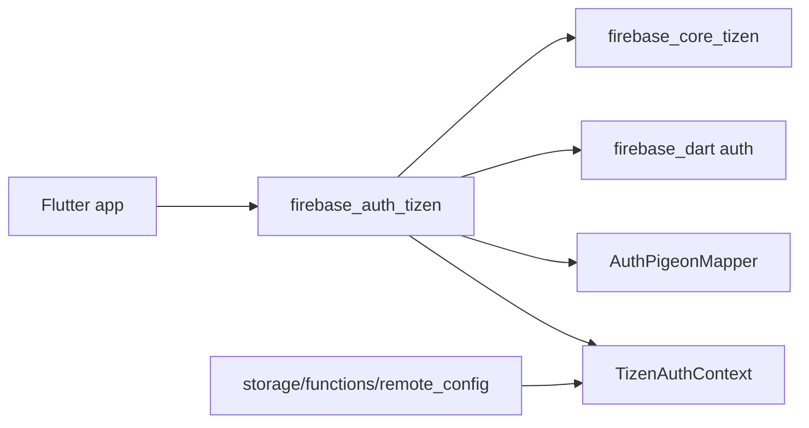

# firebase_auth_tizen

[](https://pub.dev/packages/firebase_auth_tizen)

The Tizen implementation of [`firebase_auth`](https://pub.dev/packages/firebase_auth).

This is a [non-endorsed federated implementation][federated]: add it alongside
`firebase_auth` and `firebase_core_tizen` in your app.

## Required privileges

```xml
<privileges>
  <privilege>http://tizen.org/privilege/internet</privilege>
</privileges>
```

## Usage

```yaml
dependencies:
  firebase_auth: ^6.4.0
  firebase_auth_tizen: ^0.1.0
  firebase_core: ^4.7.0
  firebase_core_tizen: ^2.0.0
```

Then use the upstream API unchanged:

```dart
import 'package:firebase_auth/firebase_auth.dart';

final UserCredential credential =
    await FirebaseAuth.instance.signInWithEmailAndPassword(
  email: 'tizen@example.com',
  password: 'correct-horse-battery',
);
```

## Supported devices

| Tizen version | TV | TV emulator |
|:-------------:|:--:|:-----------:|
| 6.0 and above | ✔️  | ✔️           |

## Limitations

The following APIs throw `UnimplementedError` with a concrete reason rather
than silently returning:

* OAuth popup / redirect sign-in (no redirect handler usable from a TV app).
  For social sign-in on TV, mint a custom token from your backend after the
  user authenticates on a companion device and call `signInWithCustomToken`.
* Phone auth (`verifyPhoneNumber`, `updatePhoneNumber`), MFA, and Auth
  emulator — Tizen has no SMS retrieval API and no reCAPTCHA verifier.
* `linkWithCredential` / `reauthenticateWithCredential` for OAuth credentials.
* Game Center, provider-specific `customParameters`, `setPersistence`.

## Design

`FirebaseAuthTizen` delegates to the `firebase_dart` auth runtime owned by
`firebase_core_tizen`. `FirebaseAuthTizen.register()` registers itself against
[`TizenAuthContext`](../firebase_core/lib/src/tizen_auth_context.dart), so
Storage, Cloud Functions, and Remote Config read a single, always-fresh ID
token instead of spinning per-package refresh timers.

## Package structure

* `lib/firebase_auth_tizen.dart`: public entrypoint that registers the Tizen federated implementation.
* `lib/src/firebase_auth_tizen.dart`: `FirebaseAuthPlatform` bridge backed by `firebase_dart`.
* `lib/src/user_tizen.dart`: upstream-shaped `UserPlatform` wrapper.
* `lib/src/pigeon_mapper.dart`: translation layer between upstream pigeon types and `firebase_dart` values.
* `lib/src/multi_factor.dart`, `action_code_settings.dart`, related helpers: explicit unsupported-surface handling.

## Flow chart



## Architecture chart



[federated]: https://docs.flutter.dev/packages-and-plugins/developing-packages#non-endorsed-federated-plugin
