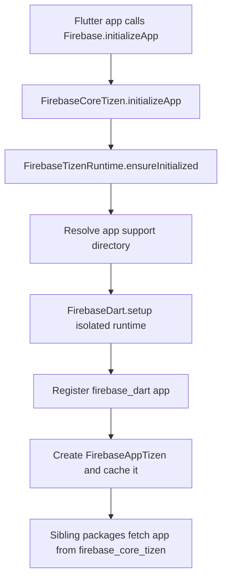
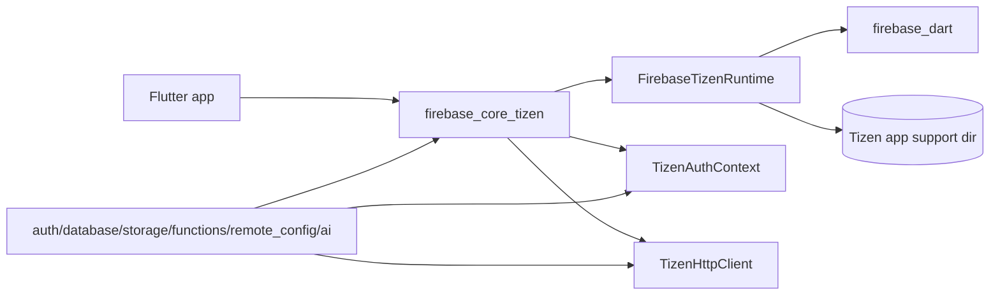

# firebase_core_tizen

[](https://pub.dev/packages/firebase_core_tizen)

The Tizen implementation of [`firebase_core`](https://pub.dev/packages/firebase_core).

This package is a [non-endorsed federated implementation][federated]: add it
alongside `firebase_core` in your app's `pubspec.yaml`.

## Required privileges

The example `tizen-manifest.xml` must declare the internet privilege — every
other Firebase Tizen plugin relies on network access brokered through this
package.

```xml
<privileges>
  <privilege>http://tizen.org/privilege/internet</privilege>
</privileges>
```

## Usage

```yaml
dependencies:
  firebase_core: ^4.7.0
  firebase_core_tizen: ^2.0.0
```

Then use the upstream API as you would on any other platform:

```dart
import 'package:firebase_core/firebase_core.dart';

await Firebase.initializeApp(
  options: const FirebaseOptions(
    apiKey: '...',
    appId: '...',
    messagingSenderId: '...',
    projectId: '...',
  ),
);
```

## Supported devices

| Tizen version | TV | TV emulator |
|:-------------:|:--:|:-----------:|
| 6.0 and above | ✔️  | ✔️           |

## Limitations

* `SetAutomaticDataCollectionEnabled` and `SetAutomaticResourceManagementEnabled`
  throw `UnimplementedError` — Firebase Analytics is not available on Tizen,
  and `firebase_dart` does not expose a knob for automatic resource management.
* Options cannot be read from native `firebase_options` resources; pass
  `FirebaseOptions` explicitly to `Firebase.initializeApp`.

## Design

See [`docs/architecture.md`](../../docs/architecture.md) for a description of
the shared runtime, the `TizenAuthContext` token broker, and the isolate in
which `firebase_dart` lives.

## Package structure

* `lib/firebase_core_tizen.dart`: public entrypoint and the internal exports that sibling Tizen packages reuse.
* `lib/src/firebase_core_tizen_impl.dart`: federated `FirebasePlatform` implementation and app cache.
* `lib/src/firebase_tizen_runtime.dart`: process-wide `firebase_dart` bootstrap, app registry, and storage-path ownership.
* `lib/src/firebase_app_tizen.dart`: concrete `FirebaseAppPlatform` wrapper used by the app cache.
* `lib/src/tizen_auth_context.dart`: shared auth-token broker used by Storage, Functions, and other REST-backed packages.
* `lib/src/tizen_http_client.dart`: authenticated HTTP helper shared by every pure-Dart package.

## Flow chart



## Architecture chart



[federated]: https://docs.flutter.dev/packages-and-plugins/developing-packages#non-endorsed-federated-plugin
