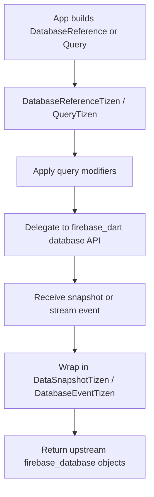
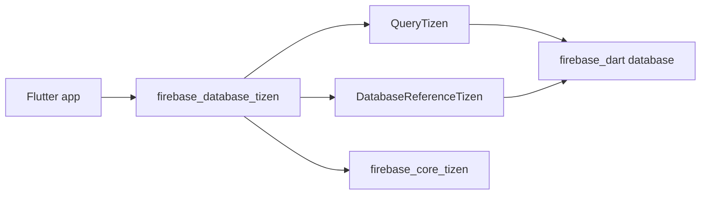

# firebase_database_tizen

[](https://pub.dev/packages/firebase_database_tizen)

The Tizen implementation of
[`firebase_database`](https://pub.dev/packages/firebase_database).

Non-endorsed federated plugin: add it alongside `firebase_database` and
`firebase_core_tizen` in your app.

## Required privileges

```xml
<privileges>
  <privilege>http://tizen.org/privilege/internet</privilege>
</privileges>
```

## Usage

```yaml
dependencies:
  firebase_core: ^4.7.0
  firebase_core_tizen: ^2.0.0
  firebase_database: ^12.3.0
  firebase_database_tizen: ^0.2.0
```

```dart
import 'package:firebase_database/firebase_database.dart';

final DatabaseReference ref =
    FirebaseDatabase.instance.ref('players');
await ref.push().set(<String, Object?>{
  'name': 'tizen-demo',
  'score': 0,
});
```

## Supported devices

| Tizen version | TV | TV emulator |
|:-------------:|:--:|:-----------:|
| 6.0 and above | ✔️  | ✔️           |

## Limitations

* `setPersistenceEnabled(true)` throws `UnimplementedError`. The cache is
  memory-only; Firebase's disk persistence is intentionally disabled because
  `firebase_dart` has an unresolved bug where the Hive box grows without
  bound. Tizen storage budgets cannot absorb that.
* `useDatabaseEmulator` throws `UnimplementedError` — the emulator relies
  on loopback TLS that Tizen TV does not trust.
* `purgeOutstandingWrites` and `goOnline`/`goOffline` delegate to
  `firebase_dart` best-effort; they may be no-ops on cold start.
* `startAfter` / `endBefore` cursor queries follow the `firebase_dart`
  semantics, which do not always match the native SDK byte-for-byte at the
  edges of mixed-type ranges.

## Package structure

* `lib/firebase_database_tizen.dart`: package entrypoint and registration hook.
* `lib/src/firebase_database_tizen.dart`: `FirebaseDatabasePlatform` implementation.
* `lib/src/database_reference_tizen.dart`: reference/query wrappers, transactions, and event adaptation.
* `lib/src/data_snapshot_tizen.dart`: upstream-shaped snapshot mapping.
* `lib/src/on_disconnect_tizen.dart`: `OnDisconnect` wrapper over the shared runtime.

## Flow chart



## Architecture chart


