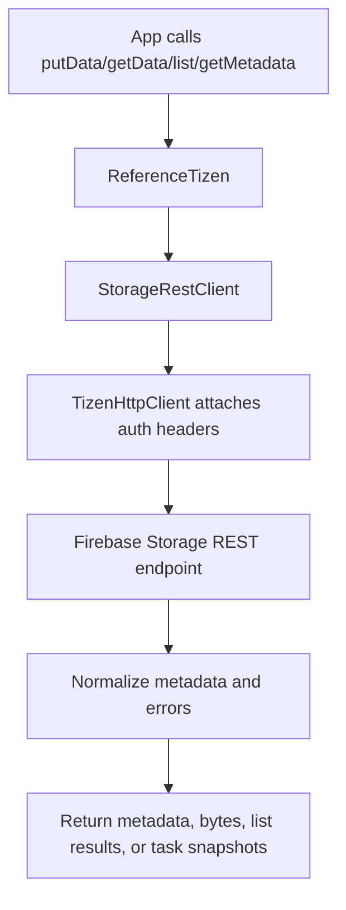
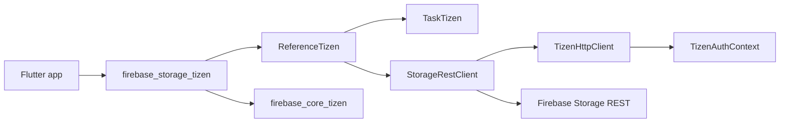

# firebase_storage_tizen

[](https://pub.dev/packages/firebase_storage_tizen)

The Tizen implementation of [`firebase_storage`](https://pub.dev/packages/firebase_storage).

Non-endorsed federated plugin: add it alongside `firebase_storage` and
`firebase_core_tizen`. Authentication tokens are brokered through
`firebase_core_tizen`'s `TizenAuthContext` — drop in `firebase_auth_tizen` if
your app needs an end-user session.

## Required privileges

```xml
<privileges>
  <privilege>http://tizen.org/privilege/internet</privilege>
  <!-- Optional: add mediastorage if the app reads user media for upload. -->
  <!-- <privilege>http://tizen.org/privilege/mediastorage</privilege> -->
</privileges>
```

## Usage

```yaml
dependencies:
  firebase_core: ^4.7.0
  firebase_core_tizen: ^2.0.0
  firebase_storage: ^13.3.0
  firebase_storage_tizen: ^0.2.0
```

```dart
import 'package:firebase_storage/firebase_storage.dart';

final Reference ref = FirebaseStorage.instance.ref('profile.png');
final UploadTask task = ref.putFile(File('/tmp/profile.png'));
await task;
final String url = await ref.getDownloadURL();
```

## Supported devices

| Tizen version | TV | TV emulator |
|:-------------:|:--:|:-----------:|
| 6.0 and above | ✔️  | ✔️           |

## Limitations

The implementation is a pure-Dart REST client — we do **not** depend on
`firebase_dart` for Storage because of [its unresolved putData metadata
bug](https://github.com/appsup-dart/firebase_dart/issues/36) and [listAll
path duplication bug](https://github.com/appsup-dart/firebase_dart/issues/50).

* `useStorageEmulator` throws `UnimplementedError` (loopback TLS unsupported
  on TV).
* Upload tasks support **cancel** but not **pause**/**resume**; `pause()` and
  `resume()` throw `UnimplementedError` with a reason.
* `putBlob` is web-only; Tizen callers should use `putData` / `putFile`.
* Custom download-token issuance is not part of the public Storage API —
  pre-mint tokens in the Firebase console or the Admin SDK.

## Package structure

* `lib/firebase_storage_tizen.dart`: public package registration.
* `lib/src/firebase_storage_tizen.dart`: `FirebaseStoragePlatform` implementation and instance caching.
* `lib/src/reference_tizen.dart`: reference tree, metadata conversion, and task creation.
* `lib/src/storage_rest_client.dart`: direct REST client for metadata, uploads, downloads, and listing.
* `lib/src/task_tizen.dart`: upload/download task state machine surfaced as upstream `TaskPlatform`.
* `lib/src/storage_error_mapper.dart`: HTTP/storage error normalization into FlutterFire error codes.

## Flow chart



## Architecture chart


